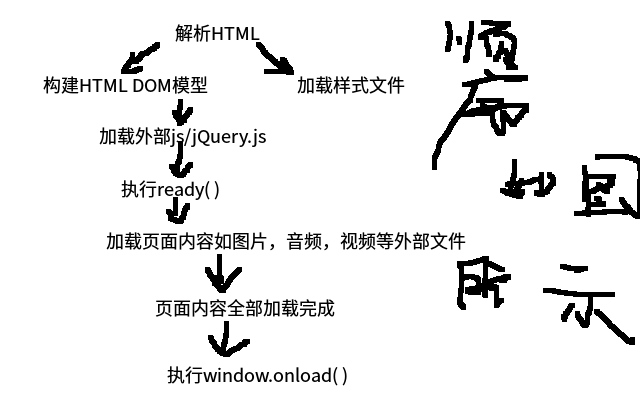

# jquery阶段测试(注：以下所有jQuery方法使用前要加上jQuery库)
## 1. 原生 js 与 jquery 对象的互相转换方式分别有哪些
```
  js转换为jquery对象：使用$()可将DOM对象换为jquery对象；

  jquery转换为js对象：如jquery[0]、或者jquery.get(0)，可将jquery对象转换为DOM对象
```

## 2. 画图:jquery的ready事件和原生js的window.onload事件,在浏览器中的执行顺序(如下图所示)




## 3. 如何将一个 HTML 元素添加到 DOM 树中的,写一段实例代码说明
```
  1.使用append()可以将指定内容插入到对应的DOM树内的末尾处；
    <script>
      $('body').append(document.createElement("div"));
    </script>

  2.使用appendTo()可以将指定内容插入到对应的DOM树内的末尾处；
    <script>
      $('<h1>万万没想到居然有画图</h1>').appendTo("body");
    </script>

  3.使用prepend()可将HTML元素添加到对应DOM数中；
    <script>
      $('body').prepend(document.createElement("div"));
    </script>

  4.使用prependTo()可将HTML元素添加到对应DOM数中；
  <script>
    $('<h1>万万没想到居然有画图</h1>').prependTo("body");
  </script>
```

## 4. 使用 jQuery 来提取一个 HTML标记的属性 例如. 链接的href, 写一段代码说明
```
  例：<body>
        <a href="#"></a>
     </body>
     1.可以使用attr()获取匹配的href
       <script>
         $('body a').attr('href');
       </script>

      2.可以使用prop()获取匹配的href
       <script>
         $('body a').prop('href');
       </script>
```

## 5. jQuery中 detach() 和 remove() 方法的区别是什么
```
  detach():移除节点时，绑定事件和附加数据会保留下来不会被一起移除
  remove():移出节点时，有两种情况：
          1.有参数：移除匹配的节点以及匹配节点的所有子节点，
            包括匹配移除节点上的绑定事件和附加的数据
          2.无参数：移除指定的节点以及指定节点的所有子节点，
            包括指定移除节点上的绑定事件和附加的数据
```

## 6. 如何利用jQuery来向一个元素中添加和移除CSS类
```
  CSS例：.aaa{
        backgroud:red;
      }
  添加：addClass()
        <script>
          $(function(){
              $('body').addClass('aaa');
            })
        </script>
  删除：removeClass()
        <script>
          $(function(){
              $('body').removeClass('aaa');
            })
        </script>
  添加或删除：toggleClass()(已存在就删除，不存在则添加)
        <script>
          $(function(){
              $('body').toggleClass('aaa');
            })
        </script>
```
